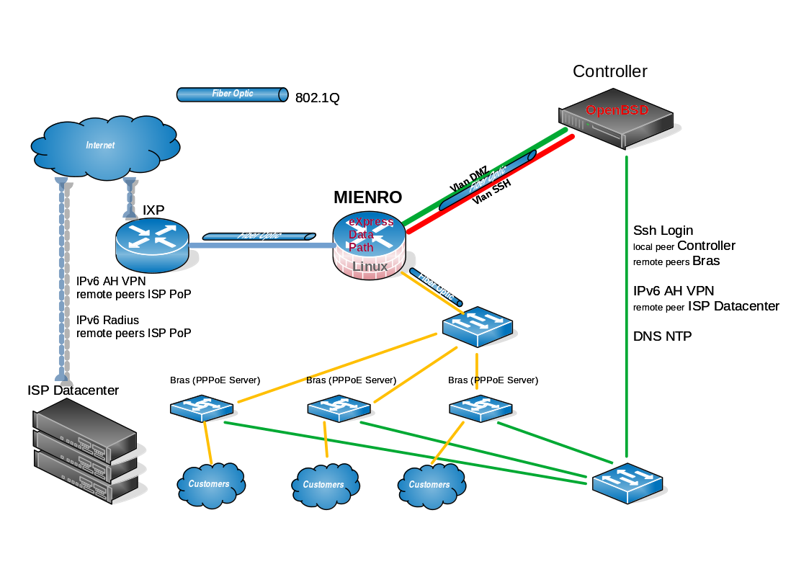

MiEnRo

MiEnRo is a Fast Packet Processing Router.
It is an experimental project designed for small Internet Service Providers and work jointly with a controller with OpenBSD OS and a set of bras.

It works with three NIC cards with XDP support.

  

Work In Progress for documentation ...
