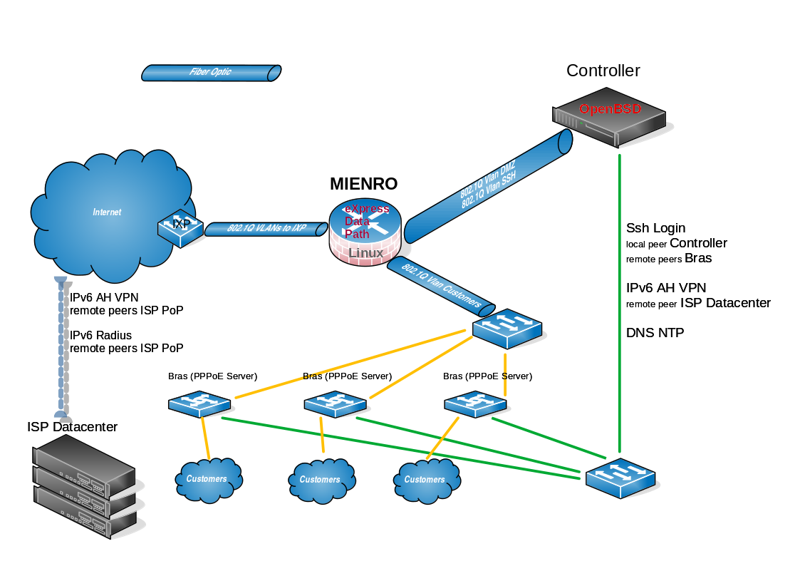

  

MiEnRo is a Fast Packet Processing Router based on the XDP (eXpress Data Path) framework.

It is an experimental project designed for small Internet Service Providers, tested only in virtualization environments and Linux containers.

All tests all done using exclusively virtualization and containerization techniques, so with the xdp generic driver.

It supports either protocols IEEE 802.3 or IEEE 802.1Q and it's firewall makes it look like as a single-stage device.

It is designed to run on the Linux operating system. Below are some instructions for a compilation on the Rocky 9.5 distribution:

cd usr/src/kernels/linux-5.14 && git clone https://github.com/m-osource/Mienro-Branch.git MiEnRo;

cd MiEnRo;

scl enable gcc-toolset-14 bash;

./configure --enable-testing --enable-ipv6ssh;

make;

make test;
